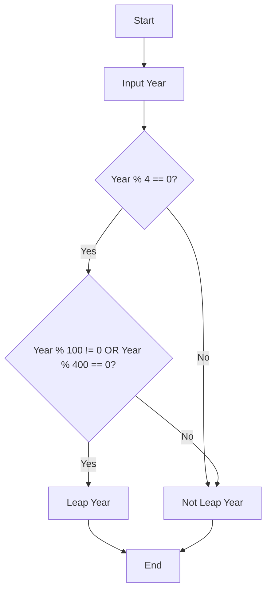
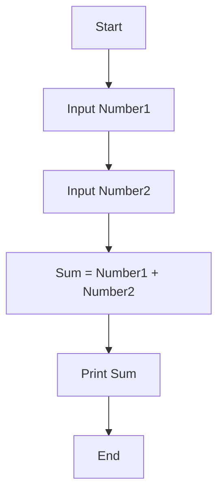
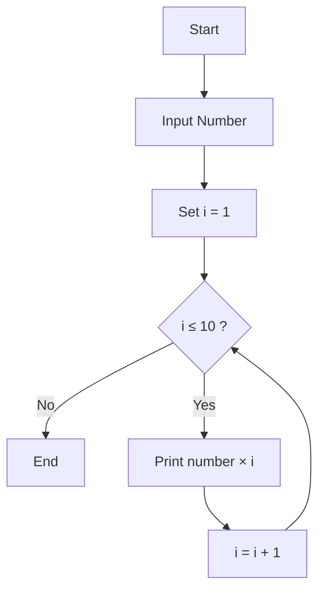
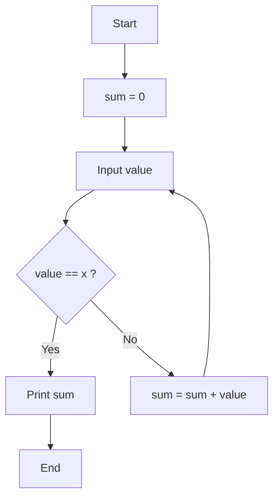

# Basic Programming Problems – Flowchart and Pseudocode

This document contains **Flowcharts and Pseudocode** for beginner programming problems.

---

# 1️⃣ Leap Year Check

## Flowchart



## Pseudocode

```
START
INPUT year

IF year % 4 == 0 THEN
    IF year % 100 != 0 OR year % 400 == 0 THEN
        PRINT "Leap Year"
    ELSE
        PRINT "Not Leap Year"
    ENDIF
ELSE
    PRINT "Not Leap Year"
ENDIF

END
```

---

# 2️⃣ Sum of Two Numbers

## Flowchart



## Pseudocode

```
START

INPUT number1
INPUT number2

sum = number1 + number2

PRINT sum

END
```

---

# 3️⃣ Multiplication Table

## Flowchart



## Pseudocode

```
START

INPUT number
SET i = 1

WHILE i <= 10
    PRINT number × i
    i = i + 1
END WHILE

END
```

---

# 4️⃣ HCF and LCM

## Flowchart

```mermaid
flowchart TD
A[Start] --> B[Input a, b]
B --> C[x = a, y = b]
C --> D{y ≠ 0 ?}
D -- No --> E[HCF = x]
D -- Yes --> F[temp = y]
F --> G[y = x % y]
G --> H[x = temp]
H --> D
E --> I[LCM = (a × b) / HCF]
I --> J[Print HCF and LCM]
J --> K[End]
```

## Pseudocode

```
START

INPUT a
INPUT b

x = a
y = b

WHILE y ≠ 0
    temp = y
    y = x % y
    x = temp
END WHILE

HCF = x
LCM = (a * b) / HCF

PRINT HCF
PRINT LCM

END
```

---

# 5️⃣ Sum Until 'x'

## Flowchart



## Pseudocode

```
START

sum = 0

REPEAT
    INPUT value

    IF value == 'x'
        BREAK
    ENDIF

    sum = sum + value

UNTIL value == 'x'

PRINT sum

END
```
